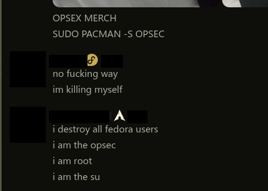

# DistroIndicators

shows what OS someone runs instead of the boring desktop icon. fork of the built-in
PlatformIndicators.

opt-in, so an icon only shows for people who picked one. u set urs in the plugin
settings and other people with the plugin see it, in the member list, on profiles and
next to messages. everyone else keeps their normal platform icon.

33 operating systems with their real logos, most distros plus windows and macos.
theres also a Tux fallback for generic linux.

heads up: the list of who picked what is **public**, since thats how every client
reads it without a lookup per person. the plugin tells u before u set anything, and
picking "none" deletes ur entry.

turn off the built-in PlatformIndicators when u use this or theyll both show.

## installing

its a userplugin, so u need vencord (or equicord) built from source. follow the
[custom plugin guide](https://docs.vencord.dev/installing/custom-plugins/), then drop
these files into `src/userplugins/distroIndicators/` and build. enable it, turn off
the built-in PlatformIndicators, and pick ur OS in the settings.

if it cant reach the backend, add `api.5ylens.lol` to vencords CSP allowlist through
the `customCspRules` setting. (once its in equicord this is handled for u.)

---

theres also a backend (a cloudflare worker on the free tier), but u dont need to touch
it, the plugin talks to the public one. its only here if u wanna run ur own, see
[`backend/`](backend/).

## credits

this is a fork of vencords built-in **PlatformIndicators**, most of the rendering
logic is theirs. full credit to the people who wrote it: **Vendicated**, **Nuckyz**,
**kemo** and **sunnie**. i just swapped the platform glyph for a distro logo and
bolted a backend on.

- icons from [simple-icons](https://github.com/simple-icons/simple-icons) (CC0) and
  wikimedia commons
- nyarch logo traced from [nyarch linux](https://nyarchlinux.moe)

GPL-3.0-or-later.
